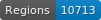
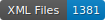

# FONDUE-MLT-CAT

   

This repo contains the transcription of catalogues, printed mainly in the 19th c. but not only

## Content

| File                           | Content                                                 | Transcription               |
|--------------------------------|---------------------------------------------------------|-----------------------------|
| `PictoCatalogs`                | Pictorialist exhibitions catalogs (Photo-Club de Paris) | Fr. Pradier                 |
| `Expositions Universelles`     | World's Fairs catalogs                                  | E. Sánchez Oeconomo         |
| `Groupe Annuaires et Adresses` | Phone directories                                       | G. Elgarrista and C. Brando |
| `IMAGO`                        | Art exhibition catalogs                                 | C. Corbières and J. Janès   |
| `Katabase`                     | Manuscript sales catalogs                               | S. Gabay and P. Kervegan    |
| `ODD`                          | French novels (out of domain data)                      | S. Gabay                    |

## How to cite

Cf. [`htr-united.yml`](https://github.com/FoNDUE-HTR/FONDUE-MLT-CAT/blob/main/htr-united.yml) file.

## Licences
Annotation is CC-BY. Most of the images come from:
- Gallica ([link](https://gallica.bnf.fr/edit/und/conditions-dutilisation-des-contenus-de-gallica))
- Metropolitan Museum of Art ([CC0](https://creativecommons.org/licenses/by/4.0))

 