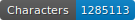
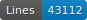

# Datasets for catalogs OCR and segmentation 

## Description

   

This repository is composed of several datasets from different research projects. These datasets contain images and transcriptions of historical catalogs (19th and 20th c. prints) and are used to train new models of segmentation and OCR. 
Segmented zones in the ALTO data presented here are following [SegmOnto guidelines](https://github.com/SegmOnto/Guidelines). 

- `PictoCatalogs` : composed of pictorialist exhibitions catalogs (Photo-Club de Paris).
- `Expositions Universelles`: composed of World's Fairs catalogs. 
- `Groupe Annuaires et Adresses` : composed of a directory. 
- `IMAGO`: composed of art exhibition catalogs. 
- `Katabase`: composed of manuscript sales catalogs. 
- `ODD`: composed of french novels. 

The `Groupe Annuaires et Adresses`, `IMAGO`, `Katabase` and `ODD` datasets are based on the [repository developed by Juliette Janes](https://github.com/Juliettejns/cataloguesSegmentationOCR/). 
The segmented data provided by Juliette Janes has been updated by Frédérine Pradier to match the current [SegmOnto](https://github.com/SegmOnto) controlled vocabulary. 

This repository is under construction. 

## Credits 

This repository is developed by Frédérine Pradier.

- `PictoCatalogs`: preparation has been done by Frédérine Pradier.
- `Expositions Universelles`: preparation has been done by Esteban Sánchez Oeconomo.
- `Groupe Annuaires et Adresses`: preparation has been done by Gabriela Elgarrista, under the supervision of Carmen Brando.
- `IMAGO`: preparation has been done by Caroline Corbières and Juliette Janès.
- `Katabase`: preparation has been done by Simon Gabay.
- `ODD`: preparation has been done by Simon Gabay.

## Thanks to

## Licence

`PictoCatalogs` : the catalogs are in the public domain, images are made available by the Metropolitan Museum of Art under a [CC0](https://creativecommons.org/licenses/by/4.0) license and transcriptions are [CC-BY](https://creativecommons.org/licenses/by/2.0/fr/).

`Groupe Annuaires et Adresses`, `IMAGO`, `Katabase`, `ODD` : images from catalogs published prior 1920 and transcriptions are [CC-BY](https://creativecommons.org/licenses/by/2.0/fr/). The other images are extracts of catalogs published after 1920 and are the intellectual property of their productor.

## Contacts

frederine.pradier@etu-unige.ch

